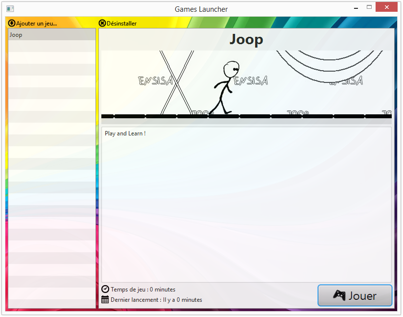
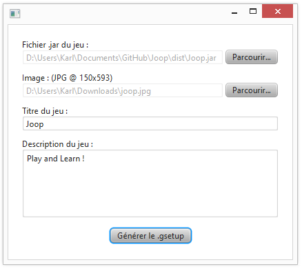
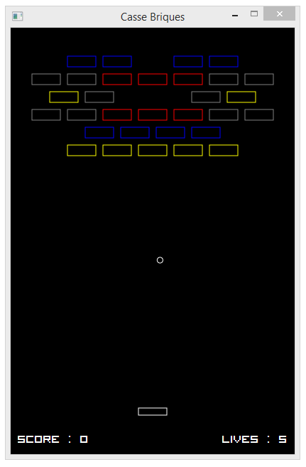

MiniGames
=========

JavaFX video-games set.

Games Launcher
--------------

Install .gsetup games files, play games.

Gsetup Wizard
-------------

Create .gsetup files for installing games in the launcher. To create a .gsetup file a game executable (.jar), a splash image and some descriptions are needed.
All datas are enclosed in a single file (game executable and libraries, splash image, metadatas).

Games Engine
------------

Tiny games engine for JavaFX games.
* Key Events handling
* Pause/Resume handling (block mouse and key events, show a pause view)

Games
-----

Somes games are availables :
* Hangman by [Laetitia Gaignier](https://github.com/Laetitia28)
* Brick Breaker by [KarlWoditsch](https://github.com/Rauks)
